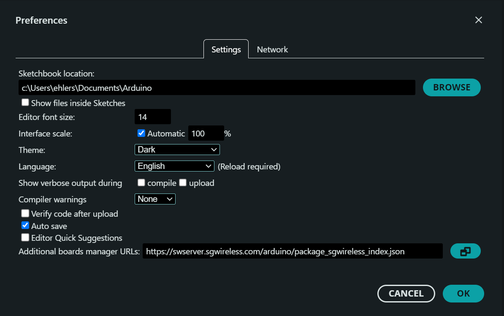
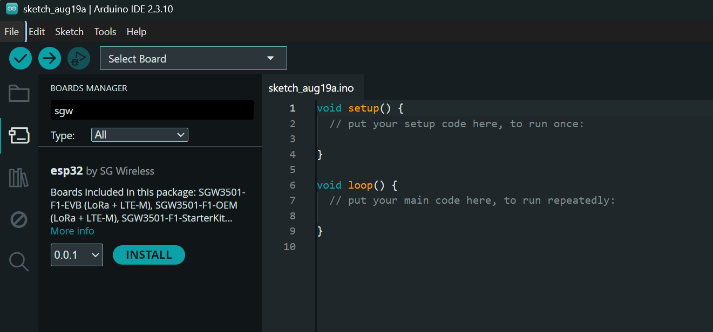
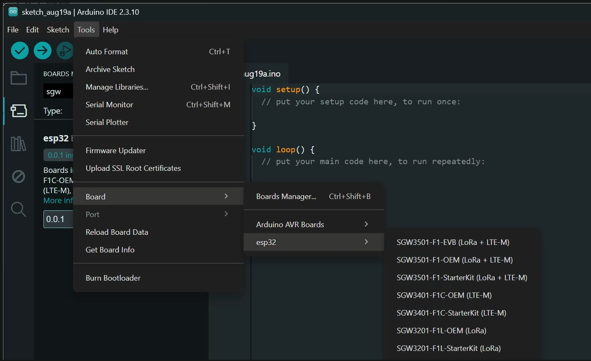
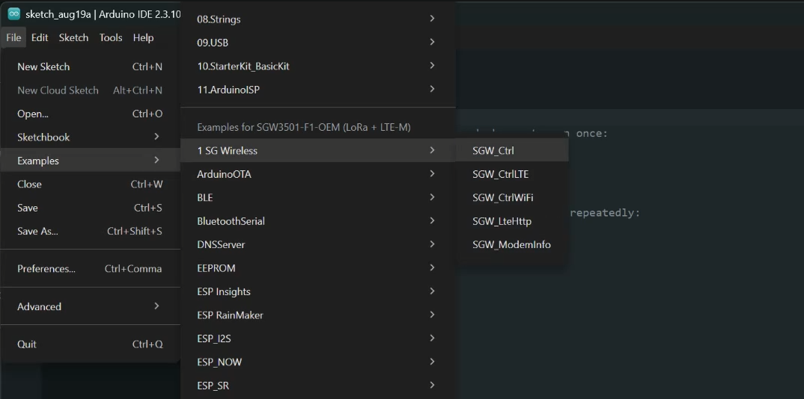
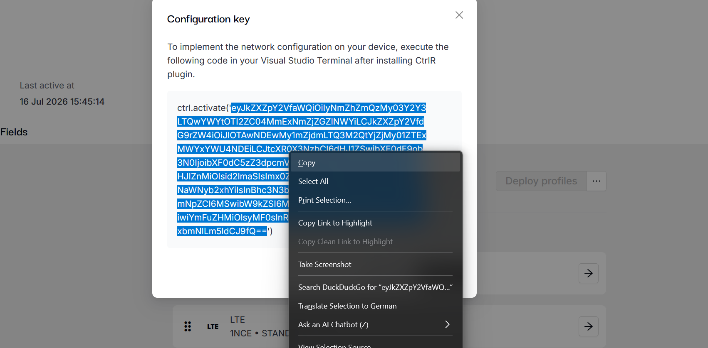

SG Wireless F1 in the Arduino IDE
=================================

SG Wireless ships an Arduino board-manager package for the F1 (ESP32-S3) module
family. Installing it gives you the boards, the SG peripherals (LTE-M modem, IO
expander, LittleFS filesystem), the CTRL client, and a set of examples —
without checking out the SDK or running its build system.

The package is built from the SG SDK, so a sketch links against the same
libraries the MicroPython firmware uses, with the same flash layout and the
same safeboot bootloader.

Table of Contents
-----------------

1.  Requirements
2.  Installing the board package
3.  Your first upload
4.  The bundled examples
5.  Configuring the examples
6.  Pin names
7.  Board capability macros
8.  Troubleshooting
9.  What the package contains
10. Building the package yourself

--------------

.. _1-requirements:

1. Requirements
---------------

- **Arduino IDE 2.x.** These instructions were written against 2.3.10.
- **An SG Wireless F1 module** and a USB cable.
- **Around 1.5 GB of free disk space** — 82 MB for the package itself, the rest
  for the Xtensa toolchain the IDE downloads alongside it.
- For the LTE-M examples, a SIM and its APN. For the CTRL examples, an
  activation token from the CTRL dashboard.

--------------

.. _2-installing-the-board-package:

2. Installing the board package
-------------------------------

.. _step-1--add-the-board-manager-url:

Step 1 — Add the board-manager URL
~~~~~~~~~~~~~~~~~~~~~~~~~~~~~~~~~~

Open **File → Preferences** (``Ctrl+,``) and paste the following into
**Additional boards manager URLs**:

::

   https://swserver.sgwireless.com/arduino/package_sgwireless_index.json

|Arduino IDE Preferences, with the SG Wireless board-manager URL entered in the
Additional boards manager URLs field|

The URL has to point at the ``.json`` file itself.

Click **OK**.

.. _step-2--install-the-package:

Step 2 — Install the package
~~~~~~~~~~~~~~~~~~~~~~~~~~~~

Open **Boards Manager** (``Ctrl+Shift+B``, or the second icon in the left
sidebar) and search for ``sgw``. The package is listed as **esp32** by **SG
Wireless**:

|Boards Manager showing the esp32 package by SG Wireless with an INSTALL
button|

Choose a version and click **INSTALL**.

The first install also fetches the Xtensa toolchain and esptool, so it takes a
few minutes. Later versions of the package reuse those.

.. _step-3--select-your-board:

Step 3 — Select your board
~~~~~~~~~~~~~~~~~~~~~~~~~~

**Tools → Board → esp32 →** and pick the module you have:

|The Tools menu, Board submenu, showing the seven SG Wireless F1 boards|

.. list-table::
   :header-rows: 1

   * - Board
     - Radios
   * - SGW3501-F1-EVB
     - LoRa + LTE-M
   * - SGW3501-F1-OEM
     - LoRa + LTE-M
   * - SGW3501-F1-StarterKit
     - LoRa + LTE-M
   * - SGW3401-F1C-OEM
     - LTE-M
   * - SGW3401-F1C-StarterKit
     - LTE-M
   * - SGW3201-F1L-OEM
     - LoRa
   * - SGW3201-F1L-StarterKit
     - LoRa

The choice does more than set a label. It fixes the flash layout, the maximum
sketch size, and the ``SGW_HAS_*`` macros the examples test to decide which
radio code to compile — so selecting a board without a modem removes the LTE
paths from the build entirely.

Then pick the serial port under **Tools → Port**.

.. _step-4--open-an-example:

Step 4 — Open an example
~~~~~~~~~~~~~~~~~~~~~~~~

**File → Examples → 1 SG Wireless →**

|The File menu, Examples submenu, showing 1 SG Wireless with its five sketches|

The SG Wireless entry appears under **Examples for <your board>**, above the
ESP32 libraries bundled with the platform.

--------------

.. _3-your-first-upload:

3. Your first upload
--------------------

``SGW_ModemInfo`` is the quickest way to confirm the board, the toolchain and
the serial port all work — it needs no account and no network:

1. **File → Examples → 1 SG Wireless → SGW_ModemInfo**
2. **Upload** (``Ctrl+U``)
3. **Tools → Serial Monitor**, set to **115200 baud**

Expected output:

::

   === SGW LTE-M modem information ===
   Powering up the modem (this takes a few seconds)...
   SIM detected.
     imei        : 356XXXXXXXXXXXX
     iccid       : 89XXXXXXXXXXXXXXXXX
     signal      : -65 dBm (rssi=24 ber=99)

A signal of ``-999 dBm (rssi=99)`` immediately after power-up is normal — the
modem reports 99 until it has measured the network.

--------------

.. _4-the-bundled-examples:

4. The bundled examples
-----------------------

.. list-table::
   :header-rows: 1

   * - Example
     - Needs
     - What it does
   * - ``SGW_Ctrl``
     - CTRL token
     - Connects over whichever network the device configuration selects — WiFi,
       LTE-M or LoRaWAN — and publishes a reading every interval. **Start
       here.**
   * - ``SGW_CtrlWiFi``
     - CTRL token
     - The same client, pinned to WiFi.
   * - ``SGW_CtrlLTE``
     - CTRL token, SIM
     - The same client, pinned to LTE-M.
   * - ``SGW_LteHttp``
     - SIM, APN
     - Brings up an LTE-M data session with explicit APN/CID/bands, then
       performs an HTTPS GET and prints the response.
   * - ``SGW_ModemInfo``
     - SIM
     - Modem, SIM, IMEI/ICCID, operator and signal strength. No data
       connection.

The CTRL examples need a device configuration
~~~~~~~~~~~~~~~~~~~~~~~~~~~~~~~~~~~~~~~~~~~~~

``SGW_Ctrl``, ``SGW_CtrlWiFi`` and ``SGW_CtrlLTE`` do not carry credentials in
the sketch. They read a device configuration holding the network settings, the
MQTT host, and — for LoRaWAN — the DevEUI, region and keys. There are two ways
to get one onto the device:

- The device already holds a configuration, for example from running
  MicroPython with CTRL configured. Leave ``ACTIVATION_TOKEN`` empty.
- Paste an activation token from the CTRL dashboard into ``ACTIVATION_TOKEN``.
  It is used once on first boot and the resulting configuration is persisted,
  after which the token is ignored.

Copying the activation token from the platform
^^^^^^^^^^^^^^^^^^^^^^^^^^^^^^^^^^^^^^^^^^^^^^

The CTRL platform presents the token inside a ready-made MicroPython call,
under **Configuration key**:

.. code:: python

   ctrl.activate('eyJkZXZpY2VfaWQiOiIyNmZhZmQzMy03Y2Y3...')

A sketch needs only the **base64 string between the quotes** — not the
``ctrl.activate('`` prefix or the ``')`` suffix. Select just that part and copy
it:

|The CTRL platform Configuration key dialog, with only the base64 token inside
the quotes selected and the browser Copy menu open|

Then paste it between the quotes already in the sketch:

.. code:: c

   #define ACTIVATION_TOKEN     "eyJkZXZpY2VfaWQiOiIyNmZhZmQzMy03Y2Y3..."

The token is one long line with no spaces; it usually ends in ``=`` or ``==``.
If the sketch reports ``CTRL_ERR_NOT_FOUND`` and never activates, the most
common causes are a stray ``ctrl.activate('`` left at the front, a truncated
selection, or a line break introduced by the paste.

   **Treat the token as a credential.** It is base64-encoded JSON, not
   encryption: it carries the device id and token, the MQTT host, and any WiFi
   password or LoRaWAN keys in the configuration. Anyone who reads the sketch
   can decode it, so avoid committing a filled-in token to a shared repository.

``SGW_Ctrl`` never names a bearer: ``ctrlc_connect()`` walks the
configuration's network preference list, so the same sketch connects over WiFi,
LTE-M or LoRaWAN depending on what the configuration asks for.

SGW_LteHttp needs no account
~~~~~~~~~~~~~~~~~~~~~~~~~~~~

It talks to the modem directly through the ``espmodem_*`` API. Set ``LTE_APN``
to your SIM provider's APN, and optionally narrow ``LTE_BANDS`` to the bands
your operator uses — fewer bands means a faster attach, because the modem
sweeps only what you list.

--------------

.. _5-configuring-the-examples:

5. Configuring the examples
---------------------------

Each sketch has a block of ``#define``\ s at the top. The CTRL examples share
the same set.

Logging
~~~~~~~

.. list-table::
   :header-rows: 1

   * - Define
     - Default
     - Meaning
   * - ``SDK_LOGS_ENABLED``
     - ``1``
     - Bring up the SDK's log backend. Leave it on: the SDK's asserts log the
       reason and then deliberately crash, so with the backend off a
       driver-level failure resets the board with no output at all.
   * - ``SDK_LOGS_COLOR``
     - ``0``
     - ANSI colouring. The IDE's Serial Monitor prints escape sequences
       literally instead of rendering them, so this is off by default; set it
       to ``1`` in a real terminal.
   * - ``CTRL_DEBUG``
     - ``2``
     - CTRL subsystem verbosity, 0 (off) to 5. At the default of 2 you get
       errors and warnings; 3 adds informational messages and 4 adds
       protocol-level detail. Needs ``SDK_LOGS_ENABLED``.

An Arduino build has no SDK ``main()``, so anything the SDK normally does at
startup has to be done by the sketch. ``init_log_system()`` is the clearest
example, and it is why ``SDK_LOGS_ENABLED`` exists.

Filesystem and servers
~~~~~~~~~~~~~~~~~~~~~~

.. list-table::
   :header-rows: 1

   * - Define
     - Default
     - Meaning
   * - ``VFS_ENABLED`` / ``VFS_MOUNT``
     - ``1`` / ``"/vfs"``
     - Mount the LittleFS ``vfs`` partition. This is the same filesystem
       instance MicroPython uses, so files written from a sketch are visible
       there and vice versa.
   * - ``CFG_STORE``
     - ``0``
     - Persist the device configuration to ``<VFS_MOUNT>/ctrl_config.json``
       instead of NVS alone. Requires ``VFS_ENABLED``.
   * - ``FTP_ENABLED``, ``FTP_USER``, ``FTP_PASS``, ``FTP_START_LTE``
     - off
     - FTP server on port 21, rooted at ``VFS_MOUNT``. Requires
       ``VFS_ENABLED``.
   * - ``TELNET_ENABLED``, ``TELNET_USER``, ``TELNET_PASS``,
       ``TELNET_START_LTE``
     - off
     - Telnet server on port 23. See the caveat below.

Both servers are configured **after** ``ctrlc_connect()`` in the examples.
Connecting reloads the token from NVS, which would discard credentials applied
before that point.

   **The telnet server is not a shell.** The MicroPython REPL is not part of an
   Arduino build, and with no client handler registered the server echoes back
   what it receives. That is useful for proving the port is reachable, not for
   driving the device. For a real session, register your own handler with
   ``sg_telnetd_start()`` — ``sg_telnetd.h`` ships in the package.

CTRL behaviour
~~~~~~~~~~~~~~

.. list-table::
   :header-rows: 1

   * - Define
     - Default
     - Meaning
   * - ``CTRL_MQTTv5``
     - ``0``
     - Use MQTT v5. The device configuration must also allow it.
   * - ``CTRL_INSECURE``
     - ``0``
     - Skip TLS certificate verification. Development only.
   * - ``MQ_SIZE`` / ``MQ_ON_FULL``
     - ``10`` / ``CTRLC_MQ_OLDEST``
     - Offline send queue: how many messages to buffer while disconnected, and
       what to do when it fills. The default discards the oldest reading to
       make room for the newest, which is usually what you want from a sensor.
       The alternatives are ``_IGNORE`` (reject the new reading and keep the
       backlog), ``_NEWEST`` (replace the most recent) and ``_PURGE`` (drop the
       whole queue).
   * - ``FW_URL``
     - ``""``
     - Image fetched when a FW-OTA command arrives. Empty ignores those
       requests.
   * - ``SEND_INTERVAL_MS``
     - ``30000``
     - Publish interval on WiFi and LTE-M.
   * - ``LORA_SEND_INTERVAL_MS``
     - ``60000``
     - Publish interval when the session runs over LoRaWAN.

Why LoRaWAN has its own interval
~~~~~~~~~~~~~~~~~~~~~~~~~~~~~~~~

LoRaWAN is duty-cycle limited rather than bandwidth limited. The CTRL client
sets a minimum spacing of its own — reported at connect as ``duty=10000ms`` —
and a send that lands inside that window is queued for up to 30 seconds rather
than rejected. Uplink airtime also grows sharply with the spreading factor:
roughly 50 ms at SF7 but around 1.5 s at SF12, where the EU868 1% limit implies
minutes between sends. ``SGW_Ctrl`` picks the interval per iteration from
``ctrlc_get_network_type()``, so a session that reconnects onto a different
bearer re-paces itself.

--------------

.. _6-pin-names:

6. Pin names
------------

Both forms work, and refer to the same pin:

.. code:: c

   pinMode(P12, OUTPUT);   // silkscreen name
   pinMode(21,  OUTPUT);   // GPIO number

Defined for every board in the package:

.. list-table::
   :header-rows: 1

   * - Names
     - Meaning
   * - ``P0`` … ``P23``
     - The pin numbering printed on the board
   * - ``PEXT1`` … ``PEXT4``
     - Expansion header pins
   * - ``LTE_UART1_RXD``, ``_TXD``, ``_CTS``, ``_RTS``
     - Modem UART lines
   * - ``USB_N``, ``USB_P``
     - USB data lines

These are generated from the same source as MicroPython's ``machine.Pin.P12``
names, so a pin is called the same thing in both languages.

--------------

.. _7-board-capability-macros:

7. Board capability macros
--------------------------

The board you select in **Tools → Board** defines a macro for each hardware
feature it carries, so one sketch can support several modules:

.. code:: c

   #ifdef SGW_HAS_LTE
     /* the modem exists on this board */
   #endif

.. list-table::
   :header-rows: 1

   * - Macro
     - Feature
   * - ``SGW_HAS_LORA``
     - LoRa radio
   * - ``SGW_HAS_LTE``
     - LTE-M modem
   * - ``SGW_HAS_SECURE_ELEMENT``
     - Secure element
   * - ``SGW_HAS_SAFEBOOT_SWITCH``
     - Safeboot switch
   * - ``SGW_HAS_RGB_LED``
     - RGB LED
   * - ``SGW_HAS_FUEL_GAUGE``
     - Battery fuel gauge
   * - ``SGW_HAS_MQTT_V5``
     - MQTT v5 support built in

``SGW_Ctrl`` uses these to print the board's radios at startup, and to compile
out the paths a given board cannot use.

--------------

.. _8-troubleshooting:

8. Troubleshooting
------------------

Escape sequences in the Serial Monitor
~~~~~~~~~~~~~~~~~~~~~~~~~~~~~~~~~~~~~~

::

   [34m|000:00:02-219|  info  [34m|0:sys_evt  ...[m

The SDK log output is colourised and the Serial Monitor does not render ANSI.
Set ``SDK_LOGS_COLOR`` to ``0`` (the default in the shipped examples).

The board resets with a Guru Meditation and no explanation
~~~~~~~~~~~~~~~~~~~~~~~~~~~~~~~~~~~~~~~~~~~~~~~~~~~~~~~~~~

Set ``SDK_LOGS_ENABLED`` to ``1``. The SDK's asserts deliberately crash after
logging the reason, so without the log backend running you see the crash and
not the reason.

HTTPS fails with ``mbedtls_ssl_handshake returned -0x2700``
~~~~~~~~~~~~~~~~~~~~~~~~~~~~~~~~~~~~~~~~~~~~~~~~~~~~~~~~~~~

That is ``MBEDTLS_ERR_X509_CERT_VERIFY_FAILED``, and the usual cause is the
clock: the ESP32 boots at 1970-01-01, so every certificate looks "not yet
valid". The device needs its time set before the first TLS connection.
``SGW_LteHttp`` does this with ``SYNC_TIME`` (SNTP, falling back to RFC 868);
the CTRL client does it internally before opening MQTT.

``Send failed`` over LoRaWAN
~~~~~~~~~~~~~~~~~~~~~~~~~~~~

Usually duty-cycle backpressure rather than a fault. Raise
``LORA_SEND_INTERVAL_MS``, particularly if the gateway is distant and the
device has settled on a high spreading factor.

The IDE keeps using an old version of the package
~~~~~~~~~~~~~~~~~~~~~~~~~~~~~~~~~~~~~~~~~~~~~~~~~

Board Manager caches by version, so reinstalling the same version number does
not necessarily refresh the files. Remove the platform in Boards Manager first,
then install again.

Sketch too big
~~~~~~~~~~~~~~

The app partition is 2560 KB. The reported maximum (2621440 bytes) is the real
partition size from the SG flash layout, not a generic ESP32 default — a sketch
that fits will flash.

--------------

.. _9-what-the-package-contains:

9. What the package contains
----------------------------

Compiled in and available to a sketch:

- **CTRL client** — WiFi, LTE-M and LoRaWAN, with MQTT, FC-OTA and FW-OTA
- **LTE-M modem** driver (``espmodem.h``) for direct use without CTRL
- **LittleFS** on the ``vfs`` partition (``ctrl_vfs.h``), shared with
  MicroPython
- **FTP and telnet servers**
- **IO expander, NVS, fuel gauge and RGB LED** interfaces, per board
- The **SG partition layout** and the **safeboot bootloader**, so sketches and
  SDK firmware share a flash layout and OTA keeps working
- The complete **arduino-esp32 3.3.11** core and its bundled libraries

Deliberately not included:

- The **MicroPython runtime** and its build glue
- An Arduino example for the **raw (non-WAN) LoRa** API. The stack and headers
  ship and are on the link line, but LoRa from a sketch is currently exercised
  only through the CTRL client's LoRaWAN path.

--------------

.. _10-building-the-package-yourself:

10. Building the package yourself
---------------------------------

Everything above uses the released package. To build it from this SDK — to
iterate on an example, cut a release, or produce a package containing only your
own board — see the Arduino sections of :doc:`QuickStart.md </firmware-development>`.

For how the package is assembled, which boards ship and why, see :doc:`tools/arduino/README.md </arduino/packaging>`.

